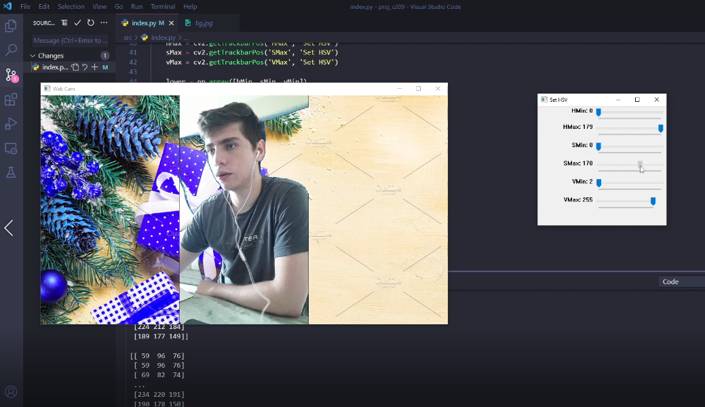

# Projeto de C209



## Como executar

1. Instalar as dependências **open cv** e **numpy** \
   <code>
   pip install --upgrade pip\
   pip install opencv-python \
   pip install numpy\
   python -m pip install -U scikit-image
   </code>

2. Rodar <code>index.py</code>

## Possíveis erros

### Erro ao abrir a imagem do background

```sh
error: (-215:Assertion failed) !_src.empty() in function 'cv::cvtColor'
```

Caso ocorra o erro acima altere o local do arquivo <code>_bg.png_</code> no sistema para para <code>_C:\bg.png_</code> e altere a linha _50_ do arquivo <code>index.py_</code>.

```py
background_image = cv2.imread('c:/bg.png')
```
